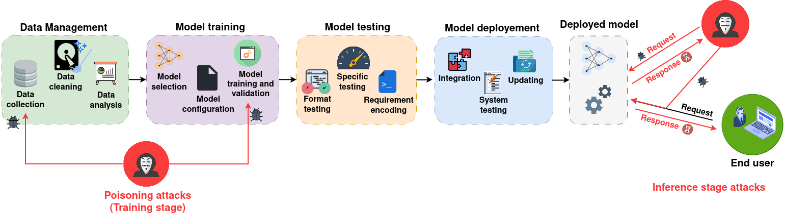

# Sponge_attacks
A collection of existing papers related to energy-latency attacks

**Table of Contents**
- [Inference Stage Attacks](#Inference-Stage-Attacks)
- [Training Stage Attacks](#Training-Stage-Attacks)

---

## Inference-Stage-Attacks

|Attack  | Venue | Target | Application | Attack setting | Papers :page_facing_up:| Code |
| :--- | :---: |:---:|:---:|:---:|:---:|:---:|
| Sponge examples  | [EuroS&P (2021)](https://www.ieee-security.org/TC/EuroSP2021/)  | Transformers + CNNs | CV & NLP | Black & white box | [paper](https://arxiv.org/abs/2006.03463) | [Github](https://github.com/iliaishacked/sponge_examples)|
|Sparsity attacks | [IEEE Transactions on Computer-Aided Design of Integrated Circuits and Systems](https://dl.acm.org/journal/tcadics)| CNNs | CV | White box | [paper](https://arxiv.org/abs/2006.08020) |  ✘ |
| ILFO | [CVPR (2020)](https://cvpr2020.thecvf.com/) |Depth-dynamic AdNNs| CV | White box | [paper](https://openaccess.thecvf.com/content_CVPR_2020/html/Haque_ILFO_Adversarial_Attack_on_Adaptive_Neural_Networks_CVPR_2020_paper.html) | ✘ |
|DeepSloth | [ICLR (2021)](https://iclr.cc/Conferences/2021) | Multi-exit CNNs | CV | White box | [paper](https://arxiv.org/abs/2010.02432) | [Github](https://github.com/Sanghyun-Hong/DeepSloth)|
|GradAuto  | [ECCV (2022)](https://eccv2022.ecva.net/) | Depth- and width-dynamic AdNNs | CV | White box | [paper](https://eprints.lancs.ac.uk/id/eprint/179610/1/Advanced_Adversarial_Attack_on_Dynamic_Neural_Networks.pdf) | [Github](https://github.com/JianhongPan/GradAuto)|
|SpikeAttack| [ACM-DAC (2022) ](https://dl.acm.org/doi/proceedings/10.1145/3489517)|SNNs | CV | White box | [paper](https://dl.acm.org/doi/pdf/10.1145/3489517.3530443) |  ✘ |
|NMTSloth | [ESEC/FSE (2022)](https://2022.esec-fse.org/) | Decoder-based NMT systems | NLP | White box | [paper](https://arxiv.org/abs/2210.03696v1) | [Github](https://github.com/SeekingDream/FSE22_NMTSloth) |
|LLMEffiChecker | [ACM Transactions on Software Engineering and Methodology](https://dl.acm.org/journal/tosem) | LLMs | NLP | Black & white box | [paper](https://arxiv.org/abs/2210.03696) | [Github](https://github.com/Cap-Ning/LLMEffiChecker) |
|NICGSlowDown | [CVPR (2022)](https://cvpr2022.thecvf.com/) | Decoder-based NICG models | CV | White box | [paper](https://arxiv.org/abs/2203.15859) | [Github](https://github.com/SeekingDream/CVPR22_NICGSlowDown) |
|EREBA | [CSE-SEIP (2022)](https://dl.acm.org/doi/proceedings/10.1145/3510457) | AdNNs | CV | Black box | [paper](https://arxiv.org/abs/2202.06084) | ✘ |
|SAME | [ACL (2023)](https://2023.aclweb.org/) | Multi-exit transformers | NLP | White box | [paper](https://arxiv.org/abs/2305.12228) |[Github](https://github.com/MatthewCYM/SAME)|
|SlowFormer |[CVPR (2024)](https://cvpr.thecvf.com/Conferences/2024) | Efficient ViTs | CV | White box | [paper](https://arxiv.org/abs/2310.02544) | [Github](https://github.com/UCDvision/SlowFormer) |
|QuantAttack | [WACV (2025)](https://wacv2025.thecvf.com/) | ViTs, DeiT | CV | White box | [paper](https://arxiv.org/html/2312.02220v2) | ✘|
|Phantom Sponge | [WACV (2023)](https://wacv2023.thecvf.com/) | Object detection | CV | White box | [paper](https://arxiv.org/abs/2205.13618) | [Github](https://github.com/AvishagS422/PhantomSponges) |
|Overload | [CVPR (2023)](https://cvpr.thecvf.com/Conferences/2023) | Object detection | CV | White box | [paper](https://arxiv.org/abs/2304.05370) | ✘ |
|SlowLiDAR|[CVPR (2023)](https://cvpr.thecvf.com/Conferences/2023)| Object detection (3D) | CV | White box | [paper](https://openaccess.thecvf.com/content/CVPR2023/papers/Liu_SlowLiDAR_Increasing_the_Latency_of_LiDAR-Based_Detection_Using_Adversarial_Examples_CVPR_2023_paper.pdf) | [Github](https://github.com/WUSTL-CSPL/SlowLiDAR) |
|AntiNODE |[CVPR (2023)](https://cvpr.thecvf.com/Conferences/2023)| ODE | CV | White box | [paper]([https://arxiv.org/abs/2304.05370](https://openaccess.thecvf.com/content/ICCV2023W/RCV/papers/Haque_AntiNODE_Evaluating_Efficiency_Robustness_of_Neural_ODEs_ICCVW_2023_paper.pdf)) | [Github](https://github.com/anonymous2015258/NODEAttack) |
|SlothSpeech | [Interspeech (2023)](https://interspeech2023.org/) | Decoder-based speech recognition models| NLP | White box | [paper](https://arxiv.org/abs/2306.00794) | [Github](https://github.com/0xrutvij/SlothSpeech) |
|Verbose images | [ICLR (2024)](https://iclr.cc/Conferences/2024) |Decoder-based VLMs | CV | White box | [paper](https://arxiv.org/abs/2401.11170) | [Github](https://github.com/KuofengGao/Verbose_Images/tree/8658c87a94df611cb1dcbdccde9420176c360e26) | 
|Uniform inputs | [SPW (2024)](https://sp2024.ieee-security.org/)| CNNs | CV | Black box | [paper](https://arxiv.org/abs/2403.18587) | [Github](https://github.com/and-mill/2024-sponge-example-analysis)

## Training-Stage-Attacks
|Attack  | Venue | Target | Application | Attack setting | Papers :page_facing_up:| Code |
| :--- | :---: |:---:|:---:|:---:|:---:|:---:|
|Sponge poisoning| arXiv (2022) & [Asia Conference on Computer and Communications Security (2023)](https://dl.acm.org/doi/proceedings/10.1145/3579856) | CNNs | CV | Full control | [paper](https://arxiv.org/abs/2203.08147) & [paper](https://arxiv.org/abs/2305.03888) | [Github](https://github.com/Cinofix/sponge_poisoning_energy_latency_attack)
| EfficFrog | [CVPR (2023)](https://cvpr.thecvf.com/Conferences/2023) | Multi-exit CNNs | CV | Partial control | [paper](https://openaccess.thecvf.com/content/CVPR2023/papers/Chen_The_Dark_Side_of_Dynamic_Routing_Neural_Networks_Towards_Efficiency_CVPR_2023_paper.pdf) | [Github](https://github.com/SeekingDream/EfficFrog) |
| Chen _et al._ | [Journal of Signal Processing Systems (2023)](https://link.springer.com/journal/11265) | CNNs | CV | Partial control | [paper](https://link.springer.com/article/10.1007/s11265-023-01895-3) :lock:| ✘|
| SkipSponge | arXiv (2024) | CNNs, GANs | CV | Full control | [paper](https://arxiv.org/abs/2402.06357v4)| ✘|
| Huang _et al._ | [IEEE Access (2024)](https://ieeeaccess.ieee.org/) |Multi-exit CNNs|CV| Full control |[paper](https://ieeexplore.ieee.org/stamp/stamp.jsp?tp=&arnumber=10445460) |✘| 
| Energy backdoor | [ICASSP (2025)](https://2025.ieeeicassp.org/) | CNNs |CV | Full control | [paper](https://arxiv.org/abs/2501.08152) | [Github](https://github.com/hbrachemi/energy_backdoor)|
